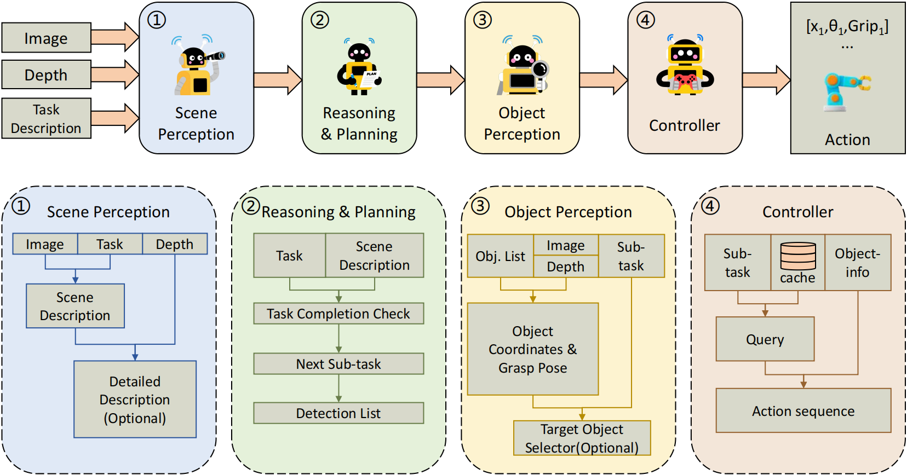

# ManiAgent: A Multi-Agent Framework for General-Purpose Manipulation Tasks

## Project Overview
ManiAgent is a framework that decomposes general-purpose manipulation tasks into multiple agents that collaborate to complete the tasks. This repository implements the deployment of the ManiAgent algorithm in the SimplerEnv simulation environment to accomplish corresponding tasks. Therefore, we have open-sourced the corresponding code and prompts for the controller, object detector, and grasper. The code for the reasoner and other parts is currently being organized and is expected to be open-sourced soon.


[](https://arxiv.org/abs/2510.11660)
[](https://yi-yang929.github.io/ManiAgent/)
[](./README_ch.md)

<p align="center">
  
  <br>
  <em>Figure 1: Overall framework diagram.</em>
</p>

## Table of Contents
- [Project Overview](#project-overview)
- [Table of Contents](#table-of-contents)
- [Recommended Configuration](#recommended-configuration)
- [Running Guide (Conda Environment)](#running-guide-conda-environment)
  - [1. Agent Environment](#1-agent-environment)
  - [2. AnyGrasp Environment](#2-anygrasp-environment)
  - [3. SimplerEnv Environment](#3-simplerenv-environment)
    - [Troubleshooting](#troubleshooting)
  - [4. Running](#4-running)
- [Running Guide (Docker)](#running-guide-docker)
- [Custom Tasks](#custom-tasks)
  - [Minimal Implementation Without AnyGrasp Configuration](#minimal-implementation-without-anygrasp-configuration)
  - [Detailed Parameter Explanations](#detailed-parameter-explanations)
    - [1. Controller](#1-controller)
    - [2. Object Detector](#2-object-detector)
    - [3. Prompt Manager](#3-prompt-manager)
    - [4. Grasper](#4-grasper)
    - [5. Simpler](#5-simpler)
- [Contact us](#contact-us)
    


## Recommended Configuration
GPU: Nvidia graphics card with 16GB or more VRAM

## Running Guide (Conda Environment)

This project uses Flask to package multiple different apps to implement various functions. To achieve the functionality, we need to configure three environments in total. We recommend using CUDA version 11.8 to avoid compatibility issues.

First, download the code.
```bash
git clone https://github.com/yi-yang929/maniagent.git
cd maniagent
git submodule update --init --recursive
```

### 1. Agent Environment

First, create the environment
```bash
conda create -n agent python=3.10 -y
conda activate agent
```
Configure the LLM API and base URL (if applicable)
```bashrc
echo 'export OPENAI_API_KEY=your_api_key' >> ~/.bashrc
echo 'export BASE_URL=https://api.openai.com/v1' >> ~/.bashrc
source ~/.bashrc
```
Install PyTorch
```bash
pip install torch==2.1.0 torchvision==0.16.0 torchaudio==2.1.0 --index-url https://download.pytorch.org/whl/cu118

# Using Ali mirror
pip install torch==2.1.0 torchvision==0.16.0 torchaudio==2.1.0 -f https://mirrors.aliyun.com/pytorch-wheels/cu118/
```
Install other packages
```bash
pip install -r requirements.txt
```

### 2. AnyGrasp Environment

Please follow the [official tutorial](https://github.com/yi-yang929/anygrasp_ManiAgent.git) for configuration.

### 3. SimplerEnv Environment

First, create the environment
```bash
conda create -n simpler_env python=3.10
conda activate simpler_env
```
Install FFmpeg
```bash
sudo apt-get install ffmpeg
```
Install SimplerEnv and ManiSkill
```bash
cd ./benchmark/simpler/ManiSkill2_real2sim
pip install -e .
cd ..
pip install -e .
pip install matplotlib mediapy omegaconf hydra-core && pip install numpy==1.24.4
```
#### Troubleshooting
If you encounter X11-related dependency issues when running SimplerEnv, you can run the following code:
```bash
su
# (Enter password)
apt-get update && apt-get install -y libvulkan1 mesa-vulkan-drivers vulkan-tools libglvnd-dev
mkdir -p /usr/share/vulkan/icd.d \
        /usr/share/glvnd/egl_vendor.d \
        /etc/vulkan/implicit_layer.d && \
printf '%s\n' \
'{' \
'    "file_format_version" : "1.0.0",' \
'    "ICD": {' \
'        "library_path": "libGLX_nvidia.so.0",' \
'        "api_version" : "1.2.155"' \
'    }' \
'}' > /usr/share/vulkan/icd.d/nvidia_icd.json && \
printf '%s\n' \
'{' \
'    "file_format_version" : "1.0.0",' \
'    "ICD" : {' \
'        "library_path" : "libEGL_nvidia.so.0"' \
'    }' \
'}' > /usr/share/glvnd/egl_vendor.d/10_nvidia.json && \
printf '%s\n' \
'{' \
'    "file_format_version" : "1.0.0",' \
'    "layer": {' \
'        "name": "VK_LAYER_NV_optimus",' \
'        "type": "INSTANCE",' \
'        "library_path": "libGLX_nvidia.so.0",' \
'        "api_version" : "1.2.155",' \
'        "implementation_version" : "1",' \
'        "description" : "NVIDIA Optimus layer",' \
'        "functions": {' \
'            "vkGetInstanceProcAddr": "vk_optimusGetInstanceProcAddr",' \
'            "vkGetDeviceProcAddr": "vk_optimusGetDeviceProcAddr"' \
'        },' \
'        "enable_environment": {' \
'            "__NV_PRIME_RENDER_OFFLOAD": "1"' \
'        },' \
'        "disable_environment": {' \
'            "DISABLE_LAYER_NV_OPTIMUS_1": ""' \
'        }' \
'    }' \
'}' > /etc/vulkan/implicit_layer.d/nvidia_layers.json
```

### 4. Running

If the agents are not running on the same device, you need to additionally modify the host parameters in each app and perform port mapping to enable effective communication.

Start the controller:
```bash
python controller/app.py
```

Start the object detector:
```bash
python object_detector/app.py
```

Start the grasper:
```bash
cd grasper/anygrasp_ManiAgent/grasp_detection
python app.py

```

Start the simulator:
```bash
cd benchmark
bash scripts/env_sh/simpler.sh ./evaluation/configs/simpler/example_simpler.yaml
```

## Running Guide (Docker)
We have packaged the agent environment and the SimplerEnv simulation environment into Docker. However, due to restrictions with AnyGrasp, we have not included AnyGrasp in the Docker image, so you need to configure the AnyGrasp environment separately. Please refer to the [official tutorial](https://github.com/yi-yang929/anygrasp_ManiAgent.git) for configuration and use our [anygrasp](https://github.com/yi-yang929/anygrasp_ManiAgent.git) code to run it.
First, download the code.
```bash
git clone https://github.com/yi-yang929/maniagent.git
cd maniagent
git submodule update --init --recursive
```
Next, open the [dockerfile](Dockerfile) and modify the `ENV` section with your `OPENAI_API_KEY` and `BASE_URL`.
At the same time, you can select an appropriate mirror source based on your local network conditions.
Build the Docker image
```bash
docker build -t maniagent .
```
Start Docker, noting the port mappings
```bash
docker run -it --gpus all \
-v $(pwd):/workspace \
-p 127.0.0.1:9500:9500 \
-p 127.0.0.1:4399:4399 \
-p 127.0.0.1:4599:4599 \
--add-host=host.docker.internal:host-gateway \
--network bridge \
maniagent:latest \
/bin/bash
```

Enter the agent environment
```bash
# （docker）
conda init && source activate
conda activate agent
```
Run the controller
```bash
# （docker）
tmux new -s controller
python controller/app.py
# (Ctrl+B, D to detach from tmux)
```
Run the detector
```bash
# （docker）
tmux new -s detector
python detector/app.py
# (Ctrl+B, D to detach from tmux)
```
Run the prompt manager
```bash
# （docker）
tmux new -s prompt_manager
python prompt_manager/app.py
# (Ctrl+B, D to detach from tmux)
```
Run the grasper

```bash
# (host)
cd grasper/anygrasp_ManiAgent/grasp_detection
python app.py
```
Enter the simulator environment and run the simulation
```bash
# （docker）
tmux new -s simpler_env
cd benchmark
bash scripts/env_sh/simpler.sh ./evaluation/configs/simpler/example_simpler.yaml
# (Ctrl+B, D to detach from tmux)
```

## Custom Tasks

### Minimal Implementation Without AnyGrasp Configuration

If you find the AnyGrasp configuration to be relatively complex, you can use our minimal implementation code. Since the stacking blocks task in SimplerEnv does not actually require AnyGrasp, you can modify the task in [simpler.sh](benchmark/scripts/env_sh/simpler.sh), for example, to the following style:
```bash
conda init && source activate
conda activate simpler_env

# Get the directory where this script is located
SCRIPT_DIR="$(cd "$(dirname "${BASH_SOURCE[0]}")" && pwd)"
# Get the project root directory (two levels up from scripts/env_sh/)
PROJECT_ROOT="$(cd "$SCRIPT_DIR/../.." && pwd)"

# Set default configuration file path
config_path="$PROJECT_ROOT/evaluation/configs/simpler/example_simpler.yaml"

# Check if configuration file parameter is passed
if [[ $# -gt 0 ]]; then
    config_path="$1"
fi

# Verify if configuration file exists
if [[ ! -f "$config_path" ]]; then
    echo "[ERROR] Configuration file does not exist: $config_path"
    exit 1
fi

echo "[INFO] Using configuration file: $config_path"

# Execute evaluation
for init_rng in 0 2 4; do
    python $PROJECT_ROOT/evaluation/run_simpler_evaluation.py --config ${config_path} \
    --set octo-init-rng ${init_rng} --set additional-env-save-tags octo_init_rng_${init_rng} \
    --set env-name StackGreenCubeOnYellowCubeBakedTexInScene-v0 --set scene-name bridge_table_1_v1 \
    --set rgb-overlay-path simpler/ManiSkill2_real2sim/data/real_inpainting/bridge_real_eval_1.png \
    --set robot widowx --set robot-init-x-range "0.147,0.147,1" --set robot-init-y-range "0.028,0.028,1";
done
```
Then run directly
```bash
cd benchmark
bash scripts/env_sh/simpler.sh ./evaluation/configs/simpler/example_simpler.yaml
```
This allows you to try our code without configuring AnyGrasp. (Due to the reduction in grasp pose offset effects, the simulation performance using this method is often higher than using AnyGrasp. However, this sacrifices generality for performance gains on specific tasks, so we recommend this method only for environment testing.)

### Detailed Parameter Explanations
The following describes the parameters that can be easily defined in our code. When running the code, you can modify parameters using the `--param [value]` format.
#### 1. Controller
| Parameter | Description and Example |
| :------- | :---------- |
| `--model` | Specifies the LLM model used for outputting actions<br>**Example**: `--model gpt-5 ` |
| `--model_detect` | Specifies the LLM model used for obtaining detection item information (recommend a lightweight model to speed up runtime)<br>**Example**: `--model_detect gpt-5 ` |
| `--port` | Specifies the port on which the service is deployed<br>**Example**: `--port 9500 ` |
| `--host` | Specifies the IP on which the service is deployed<br>**Example**: `--host 127.0.0.1 ` |
| `--use-cache` | (Boolean) Determines whether to use parameterized action sequence caching<br>**Example**: `--use-cache ` |

#### 2. object detector
| Parameter | Description and Example |
| :------- | :---------- |
| `--detect-model` | Specifies the detection model used<br>**Example**: `--detect-model microsoft/Florence-2-large ` |
| `--vlm-model` | Specifies the VLM used for object selection when multiple detected objects appear (note to select a VLM with image understanding capabilities)<br>**Example**: `--vlm-model gpt-5` |
| `--port` | Specifies the port on which the service is deployed<br>**Example**: `--port 4399 ` |
| `--host` | Specifies the IP on which the service is deployed<br>**Example**: `--host 127.0.0.1 ` |

#### 3. prompt manager
| Parameter | Description and Example |
| :------- | :---------- |
| `--port` | Specifies the port on which the service is deployed<br>**Example**: `--port 4599 ` |
| `--host` | Specifies the IP on which the service is deployed<br>**Example**: `--host 127.0.0.1 ` |

#### 4. grasper
| Parameter | Description and Example |
| :------- | :---------- |
| `--port` | Specifies the port on which the service is deployed<br>**Example**: `--port 4499 ` |
| `--host` | Specifies the IP on which the service is deployed<br>**Example**: `--host 127.0.0.1 ` |

#### 5. simpler
Parameters can be defined by modifying [simpler.sh](benchmark/scripts/env_sh/simpler.sh) and [example_simpler.yaml](benchmark/evaluation/configs/simpler/example_simpler.yaml). For details, refer to the description in the [section above](#minimal-implementation-without-anygrasp-configuration); it will not be repeated here.


## Contact Us

If you have any questions, please contact us via email: [yangyi_00929@163.com](mailto:yangyi_00929@163.com).